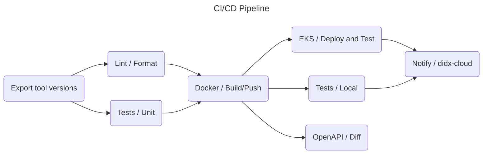

# CI/CD

The CI/CD pipeline is defined in the [cicd.yml](cicd.yml) file.

```mermaid
---
title: CI/CD Pipeline
---
flowchart LR
    ExportVersions(Export tool versions)
    Lint(Lint / Format)
    TestsUnit(Tests / Unit)
    Docker(Docker / Build/Push)
    TestsLocal(Tests / Local)
    EKS(EKS / Deploy and Test)
    Notify(Notify / didx-cloud)
    OpenAPI(OpenAPI / Diff)

    ExportVersions --> Lint
    ExportVersions --> TestsUnit
    Lint --> Docker
    TestsUnit --> Docker
    Docker --> TestsLocal
    Docker --> EKS
    EKS --> Notify
    TestsLocal --> Notify
    Docker --> OpenAPI
```

Refer to the [helm](../../helm) directory for the Helm charts and Helmfile
configs to deploy acapy-cloud.
